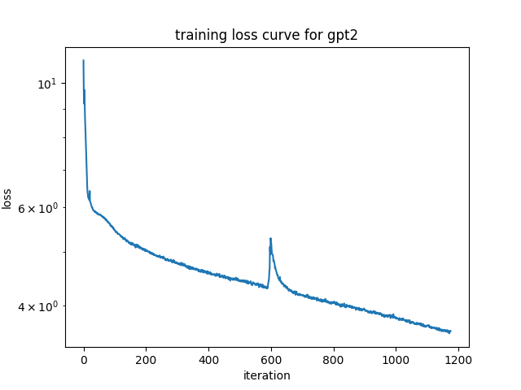
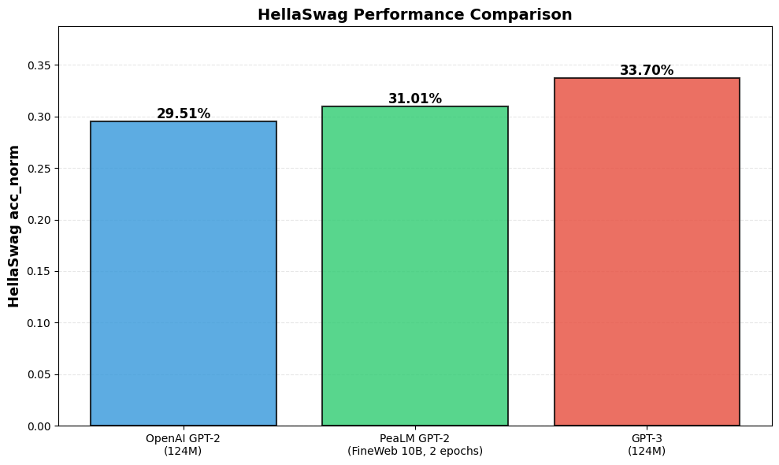
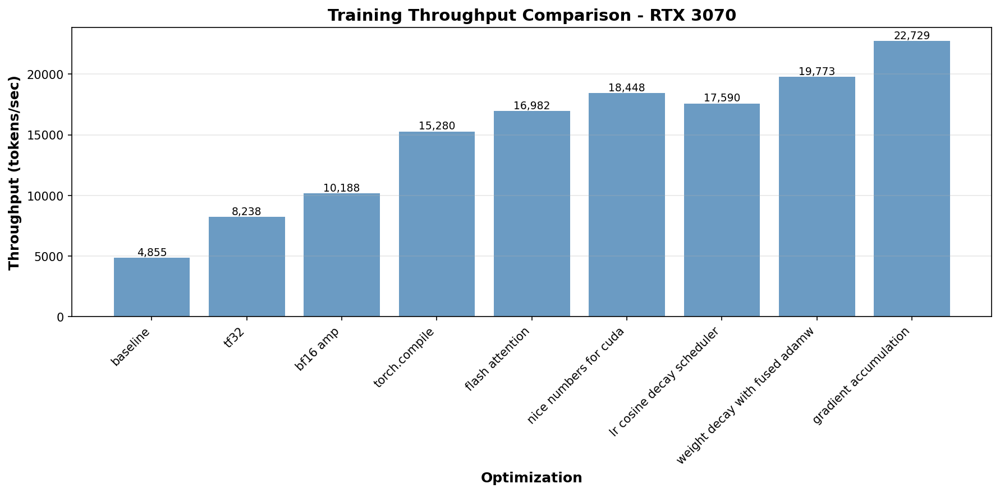
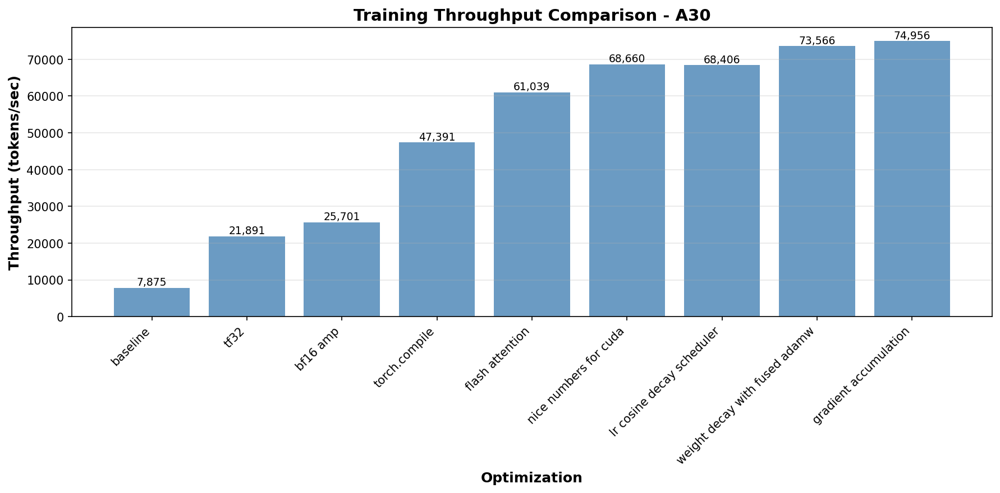

# kindergartener language models


> _Nano Banana prompt: "Logo for a repo with this README: ..."_

this repo contains two packages:

- **`pea`** -- a scalar-valued autograd engine with no dependencies
- **`pealm`** -- kindergartener language models, from bigrams to gpt2, trained
  from scratch

## `pea`

a scalar-valued autograd engine. no dependencies beyond the python standard
library.

implements a `Value` class that tracks computation graphs and supports
reverse-mode autodiff via topological sort. supports +, -, \*, /, \*\*, relu,
exp, and log.

also includes an `nn` module with `Neuron`, `Layer`, and `MLP` abstractions,
plus `softmax`, `cross_entropy_loss`, and `one_hot` utilities. `viz` module for
drawing computation graphs with graphviz.

```python
from pea import Value

a = Value(2.0)
b = Value(3.0)
c = a * b + b
c.backward()
print(a.grad)  # dc/da = 3.0
print(b.grad)  # dc/db = 2.0 + 1.0 = 3.0
```

## `pealm`

language models and a cli for training, sampling, evaluating, and managing
checkpoints. built with pytorch.

models:

- **character-level bigram** -- simple (vocab_size, vocab_size) embedding matrix
- **character-level transformer** -- multi-head self-attention with feedforward
  layers
- **gpt2 (124M)** -- full gpt2 architecture with support for loading openai
  pretrained weights

the `pealm` cli supports:

- `train` -- train any of the above models, with ddp support via `torchrun`
- `sample` -- generate text from a trained model or pretrained gpt2
- `eval` -- evaluate on hellaswag
- `convert` -- convert full checkpoints to weights-only
- `clean` -- remove training artifacts

### sampling with `pealm`

best weights-only checkpoints for all models are saved in
[the weights directory](../../weights/). you can sample from them using the
`pealm` cli:

```bash
# character-level transformer trained on tinyshakespeare
pealm sample char-transformer --ckpt weights/char_transformer/2026-01-27_22-55-53/best.pt --tokenizer-dir weights/char_tokenizer/2026-01-27_22-55-53/ -n 10000

# pretrained gpt2 from openai
pealm sample gpt2-pretrained

# token-level gpt2 trained on tinyshakespeare
pealm sample gpt2 --ckpt weights/gpt2/tinyshakespeare/2026-02-10_18-35-18/best.pt

# token-level gpt2 trained on fineweb edu 10B
pealm sample gpt2 --ckpt weights/gpt2/fineweb_edu10B/2026-02-14_01-57-22/best.pt
```

### distributed training

the train script supports distributed training with `torchrun`. you can specify
the number of nodes and GPUs per node, and `torchrun` will handle the rest.

#### GPT2 ddp training

```bash
# prepare fineweb_edu10B (one-time)
uv run scripts/fineweb.py

# single node, 2 GPUs
torchrun --standalone --nproc_per_node=2 -m pealm train gpt2

# multi-node (on each node)
torchrun \
    --nnodes=2 \
    --nproc_per_node=4 \
    --node_rank=<0 or 1> \
    --master_addr=<master_ip> \
    --master_port=29500 \
    -m pealm train gpt2

# ddp run on 10B tokens of fineweb edu data, 8x RTX 5090, B=512, microbatch=32, T=1024
OMP_NUM_THREADS=1 torchrun --standalone --nproc_per_node=8 -m pealm train gpt2 --input.npy-shards data/fineweb_edu10B --micro-batch-size 32 --save-every 5000 --steps 38146 2>&1 | tee training.log

# monitor GPU utilization and memory usage during training
watch -n 1 'nvidia-smi \
  --query-gpu=index,utilization.gpu,memory.used,memory.total \
  --format=csv && \
  echo && \
  nvidia-smi --query-compute-apps=gpu_uuid,pid,process_name,used_memory \
  --format=csv'
```

### evaluating on hellaswag

```bash
# prepare hellaswag data (one-time)
uv run scripts/hellaswag.py

# evaluate pretrained gpt2 on hellaswag
pealm eval gpt2-pretrained

# evaluate custom gpt2 trained on fineweb edu 10B on hellaswag
pealm eval gpt2 --ckpt weights/gpt2/fineweb_edu10B/2026-02-14_01-57-22/best.pt
```

## results

### character-level bigram

```txt
CharBigram(
  (embedding): Embedding(65, 65)
)
```

#### loss curve


#### losses

|          | train loss | val loss |
| -------- | ---------- | -------- |
| before   | 4.7959     | 4.7898   |
| 2 epochs | 2.4525     | 2.4879   |

#### samples

before training:

```txt
Aw'TnWDK&OZlAKmSp!-dY-y Z,kAFEArYIfO$$LCiA;N,o.V!ctazfB?SUIeYFo.OpZnkB&3BMwebcQN.qxYhfM,akHYZ3GMlSPr
```

after 2 epochs:

```txt
EEl wofavante lind s:
ANIOUr r VIDUESSow.
Jutod 'sothandora sdeneperen 't:
Yofth ll g's sed liset; i
```

### character-level transformer

#### loss curve


#### losses

|                | val loss |
| -------------- | -------- |
| before         | 4.3081   |
| epoch 1 (best) | 2.2701   |
| epoch 5        | 3.3808   |

train set loss omitted (takes too long to evaluate).

#### samples

before training:

```txt
;wtEnWDo&OUlAicSp!-di!lAZycWFa;GYtfxf$LC!TTu,okI!ctqLfBlSsIeDFotkpRv&Bi3;Mihbrp&CsxTh MoEkT&j3GllSPrC'lljyoyHW
JqBjEUvAq?MbpComIy,BhM-SBglPHYSp!Ugko&
oSCdwuhpTEyWb-idcy$;lSJxBQmd;Ri?Pq&gynzQOUou;VD:yjWdKuu-,wFBuFusg shnAtlDK?yG,.IhOdMHioJU;XOyO:P3
DCXF&qgo&x;n?&r$veCJqU?Kgl-ILxPFcyoJPhW3WypXNX
BJPTfuUlZ.gfkuKAtYFqinGTX:vVir,&r?LZVt3H&$SvHRZJuwHXp'!qx;KN&h&T WdAEJ&DTT$
',:vYcRg&ClEMg', JEdXuGGri;;i'XQrcILQrFuCEVKXwpi&EmqIGdT-VLer!D?Ov3wOvwHrgj-h-F&PqzMi:Coq? lg-R3Ao'P KgJHicOIouVvogpo&JOY3?PguQkS
```

[sampling at epoch 5](./media/char_transformer_sample.txt).

### token-level gpt2

uses the gpt2 tokenizer from `tiktoken`.

#### tinyshakespeare

##### loss curve



notice the shock at each epoch boundary, pretty common for ddp setup with which
this model is trained.

##### results

[sampling at epoch 2](./media/gpt2_tinyshakespeare_sample.txt).

#### fineweb edu 10B

##### loss curve


##### losses

| metric         | value               |
| -------------- | ------------------- |
| min train loss | 2.7484              |
| min val loss   | 3.0218 (step 38000) |

best model at step 36500 with val loss 3.0227.

##### hellaswag evals

| model                    | accuracy | normalized accuracy |
| ------------------------ | -------- | ------------------- |
| pretrained gpt2 (openai) | 0.2863   | 0.2951              |
| gpt2 fineweb edu 10B     | 0.2929   | 0.3101              |



##### results

[sampling at epoch 2](./media/gpt2_fineweb_edu10B_sample.txt).

#### comparing to openai gpt2 and gpt3

both models share the same gpt2 architecture (12 layers, 12 heads, 768 embed
dim, ~124M parameters). the pretrained model is openai's original gpt2 weights
from huggingface; the custom model is trained from scratch on tinyshakespeare.

##### hellaswag evals

+1.5% normalized accuracy improvement on hellaswag for the custom gpt2 trained
on fineweb edu 10B compared to the pretrained gpt2. -2.69% behind gpt3 that is
trained on 300B tokens of data with 175B parameters (compared to our 20B tokens
and 124M parameters).

##### weight file sizes

| model                    | format                 | size   |
| ------------------------ | ---------------------- | ------ |
| pretrained gpt2 (openai) | safetensors (HF cache) | 551 MB |
| gpt2 tinyshakespeare     | pytorch (best.pt)      | 475 MB |

##### sampling throughput

500 tokens generated per run, `--no-stream`, 5 runs each on an NVIDIA GeForce
RTX 3070 Laptop GPU.

| model                | run 1 | run 2 | run 3 | run 4 | run 5 | avg (tokens/sec) |
| -------------------- | ----- | ----- | ----- | ----- | ----- | ---------------- |
| pretrained gpt2      | 81.33 | 80.44 | 81.13 | 81.70 | 80.42 | 81.00            |
| gpt2 tinyshakespeare | 83.54 | 83.50 | 83.40 | 84.44 | 84.72 | 83.92            |

##### sample quality

the pretrained model produces coherent, general-domain english (trained on
WebText, ~40GB of internet text). the tinyshakespeare model produces
shakespeare-flavored text with character names and verse-like structure, but
with noticeably more grammatical errors and nonsensical fragments -- expected
given it was trained on only ~1MB of shakespeare.

### gpt2 optimization benchmarks

progressive optimization techniques applied to gpt2 training, showing throughput
improvements (tokens/sec) across different GPU configurations.

#### RTX 3070 Mobile (B=2, T=1024)



key improvements: bf16 amp gives 2.1x speedup over baseline, flash attention
reaches 3.5x speedup, fused adamw with weight decay hits 4.1x speedup.

#### A30 (B=8, T=1024)



key improvements: tf32 gives 2.8x speedup, torch.compile reaches 6x speedup,
flash attention hits 7.8x speedup, fused adamw peaks at 9.3x speedup.

#### 2x H100 DDP training

distributed data parallel training on 2x H100 GPUs (B=512, microbatch=64,
T=1024). loss decreases from 11 to 6.5 over 3328 training steps, achieving
**900k tokens/sec throughput**.

#### 8x RTX 5090 DDP training

**1.48M tokens/sec throughput** with 8x RTX 5090 GPUs (B=512, microbatch=32,
T=1024).
