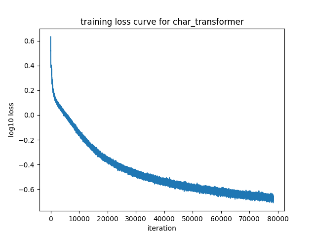

# gpt from scratch

## character-level bigram

```txt
CharBigram(
  (embedding): Embedding(65, 65)
)
```

simple (vocab_size, vocab_size) embedding matrix

### bigram loss curve


### bigram results

before training

```txt
train set avg loss: 4.795889

val set avg loss: 4.789756

Aw'TnWDK&OZlAKmSp!-dY-y Z,kAFEArYIfO$$LCiA;N,o.V!ctazfB?SUIeYFo.OpZnkB&3BMwebcQN.qxYhfM,akHYZ3GMlSPr
```

after training for 2 epochs

```txt
train set avg loss: 2.452482

val set avg loss: 2.487851


EEl wofavante lind s:
ANIOUr r VIDUESSow.
Jutod 'sothandora sdeneperen 't:
Yofth ll g's sed liset; i
```

## character-level transformer

### transformer loss curve



### transformer results

before training

```txt
val set avg loss: 4.308069

;wtEnWDo&OUlAicSp!-di!lAZycWFa;GYtfxf$LC!TTu,okI!ctqLfBlSsIeDFotkpRv&Bi3;Mihbrp&CsxTh MoEkT&j3GllSPrC'lljyoyHW
JqBjEUvAq?MbpComIy,BhM-SBglPHYSp!Ugko&
oSCdwuhpTEyWb-idcy$;lSJxBQmd;Ri?Pq&gynzQOUou;VD:yjWdKuu-,wFBuFusg shnAtlDK?yG,.IhOdMHioJU;XOyO:P3
DCXF&qgo&x;n?&r$veCJqU?Kgl-ILxPFcyoJPhW3WypXNX
BJPTfuUlZ.gfkuKAtYFqinGTX:vVir,&r?LZVt3H&$SvHRZJuwHXp'!qx;KN&h&T WdAEJ&DTT$
',:vYcRg&ClEMg', JEdXuGGri;;i'XQrcILQrFuCEVKXwpi&EmqIGdT-VLer!D?Ov3wOvwHrgj-h-F&PqzMi:Coq? lg-R3Ao'P KgJHicOIouVvogpo&JOY3?PguQkS
```

after training for 5 epochs

```txt
best val set avg loss (epoch=1): 2.2700939

(no train set because takes too long)
final val set avg loss (epoch=5): 3.3807906
```

[sampling at epoch 5](./media/char_transformer_sample.txt).

## token-level gpt2

uses the gpt2 tokenizer from `tiktoken`.

### gpt2 tinyshakespeare loss curve


notice the shock at each epoch boundary, pretty common for ddp setup with which
this model is trained.

### gpt2 tinyshakespeare results

[sampling at epoch 2](./media/gpt2_tinyshakespeare_sample.txt).

### comparing to openai gpt2

both models share the same gpt2 architecture (12 layers, 12 heads, 768 embed dim,
~124M parameters). the pretrained model is openai's original gpt2 weights from
huggingface; the custom model is trained from scratch on tinyshakespeare.

#### weight file sizes

| model                    | format                 | size   |
| ------------------------ | ---------------------- | ------ |
| pretrained gpt2 (openai) | safetensors (HF cache) | 551 MB |
| gpt2 tinyshakespeare     | pytorch (best.pt)      | 475 MB |

#### sampling throughput

500 tokens generated per run, `--no-stream`, 5 runs each on an NVIDIA GeForce
RTX 3070 Laptop GPU.

| model                | run 1 | run 2 | run 3 | run 4 | run 5 | avg (tokens/sec) |
| -------------------- | ----- | ----- | ----- | ----- | ----- | ---------------- |
| pretrained gpt2      | 81.33 | 80.44 | 81.13 | 81.70 | 80.42 | 81.00            |
| gpt2 tinyshakespeare | 83.54 | 83.50 | 83.40 | 84.44 | 84.72 | 83.92            |

#### sample quality

the pretrained model produces coherent, general-domain english (trained on
WebText, ~40GB of internet text). the tinyshakespeare model produces
shakespeare-flavored text with character names and verse-like structure, but
with noticeably more grammatical errors and nonsensical fragments -- expected
given it was trained on only ~1MB of shakespeare.

### gpt2 optimization benchmarks

progressive optimization techniques applied to gpt2 training, showing throughput
improvements (tokens/sec) across different GPU configurations.

#### RTX 3070 Mobile (B=2, T=1024)


key improvements: bf16 amp gives 2.1x speedup over baseline, flash attention
reaches 3.5x speedup, fused adamw with weight decay hits 4.1x speedup.

#### A30 (B=8, T=1024)


key improvements: tf32 gives 2.8x speedup, torch.compile reaches 6x speedup,
flash attention hits 7.8x speedup, fused adamw peaks at 9.3x speedup.

#### 2x H100 DDP training

distributed data parallel training on 2x H100 GPUs (B=512, microbatch=64,
T=1024). loss decreases from 11 to 6.5 over 3328 training steps, achieving
**900k tokens/sec throughput**.

## sampling with `picogpt`

best weights-only checkpoints for all models are saved in [the weights directory](../../weights/).
you can sample from them using the `picogpt` cli:

```bash
# character-level transformer trained on tinyshakespeare
picogpt sample char-transformer --ckpt weights/char_transformer/20260127_225553/best.pt --tokenizer-dir weights/char_tokenizer/20260127_225553/ -n 10000
# pretrained gpt2 from openai
picogpt sample gpt2-pretrained
# token-level gpt2 trained on tinyshakespeare
picogpt sample gpt2 --ckpt weights/gpt2/20260210_183518/tinyshakespeare/best.pt
```

## distributed training

the train script supports distributed training with `torchrun`. you can specify
the number of nodes and GPUs per node, and `torchrun` will handle the rest.

```shell
# single node, 2 GPUs
torchrun --standalone --nproc_per_node=2 -m picogpt train gpt2

# multi-node (on each node)
torchrun \
    --nnodes=2 \
    --nproc_per_node=4 \
    --node_rank=<0 or 1> \
    --master_addr=<master_ip> \
    --master_port=29500 \
    -m picogpt train gpt2
```
